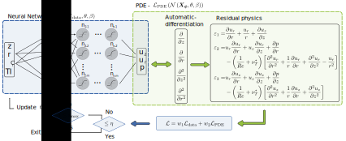
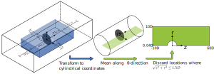

[](https://doi.org/10.5281/zenodo.10846076)

# RANS Wake PINN 
This repository is a companion piece for the article "insert article link when published". It includes the code necessary to train the models described in the paper.



---
## Setup and running the code
The code has been developed and run with an Anaconda environment *sml*. To install said environment: Clone the repository, navigate to the project directory and run the following line:
```bash
conda env create -f environment.yml
```

To run the code activate the environment and run the mainscript [*run_PINN_experiment.py*](./run_PINN_experiment.py).

```bash
conda activate sml
python3 run_PINN_experiment.py
```

> 🚨 The code was developed with the [Jax](https://github.com/google/jax)/[Flax](https://github.com/google/flax) libraries. At the begining of the project Jax only supported Linux, since support has been added for Windows and Mac. However, the code has only been verfied to run on Linux. For detailed installation instructions visit the [Jax documentation](https://jax.readthedocs.io/en/latest/index.html).

> 💡 To configure hyperparameters during training the [Hydra](https://hydra.cc/) framework has been used. The predefined cases that was used in the paper are included and can be uncommented at the top of the [*run_PINN_experiment.py*](./run_PINN_experiment.py) script.


### Results
The results can be found in the [Results](./Results) folder. It contains data from the training runs described in the paper and post-processing notebooks.

--- 
## Available data 
The data used in the training of the models is available in the data folder ([RANS_1wt_irot_v2.nc](./Data/RANS_1wt_irot_v2.nc)). The dataset was originally generated with the DTU in-house CFD solver [Ellipsys](https://the-numerical-wind-tunnel.dtu.dk/ellipsys) using the [PyWakeEllipsys](https://topfarm.pages.windenergy.dtu.dk/cuttingedge/pywake/pywake_ellipsys/master/index.html) framework. The data shared in this repo is post-processed into a cylindrical axisymmetric dataset as illustrated below:


## Citing
If you use this repository in your scientific work please consider citing us:
```latex
Insert reference to article and zenodo once obtained.
```